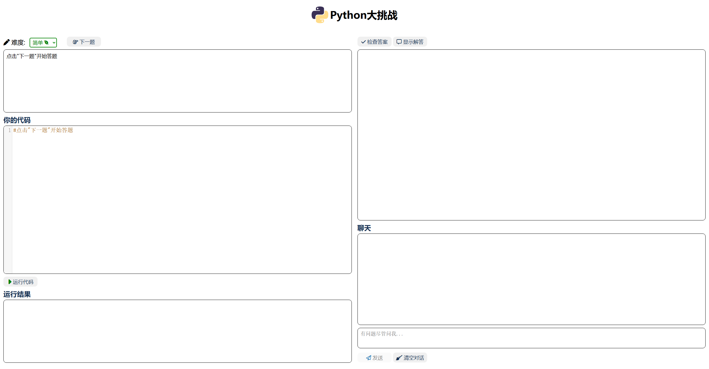

# PyTeacher
## Introduction
PyTeacher helps you to create a simple and interactive quiz for new Chinese Python learners. It leverages LLMs to generate code filling questions, check answers, and discuss any problem. It can also enrich the quiz and improve the question generator by validating questions. Hope it can play as a helpful teacher for children who are just starting to learn Python. 

The project is based on Python Flask and Azure OpenAI API. Visit http://20.243.206.18:5000/ to see our demo.



## Features
- **Quiz Creation**: Users can create programming quizzes with different difficulty levels.
- **Code running**: Users can run the code and get the outputs. 
- **Answer Checking**: Users can check their codes with or without displaying the correct answer and explanation.
- **Chat System**: Users can have real-time discussions with a virtual teacher.
- **Question validation**: An LLM can be used to validate the generated questions, enriching the question bank, and analyzing the mistakes in questions to help you improve the prompt.

## Installation
1. Clone the repository
2. Install the required packages
    ```bash
    pip install -r requirements.txt
    ```
3. Update ```config.json```, fill into your Azure OpenAI API information.
4. Deploy Pyteacher by gunicorn
    ```bash
    gunicorn -w 10 -b 0.0.0.0:5000 main:app
    ```
5. Open the browser and visit `http://<your machine ip>:5000`
6. (Optional) Run question validator
    ```bash
    python checkQuestions.py
    ```

## License
This project is licensed under the Creative Commons Attribution-NonCommercial 4.0 International (CC BY-NC 4.0) License. This means you are free to:
- **Share**: Copy and redistribute the material in any medium or format.
- **Adapt**: Remix, transform, and build upon the material.

However, the following terms apply:
- **Attribution**: You must give appropriate credit, provide a link to the license, and indicate if changes were made. You may do so in any reasonable manner, but not in any way that suggests the licensor endorses you or your use.
- **NonCommercial**: You may not use the material for commercial purposes.
